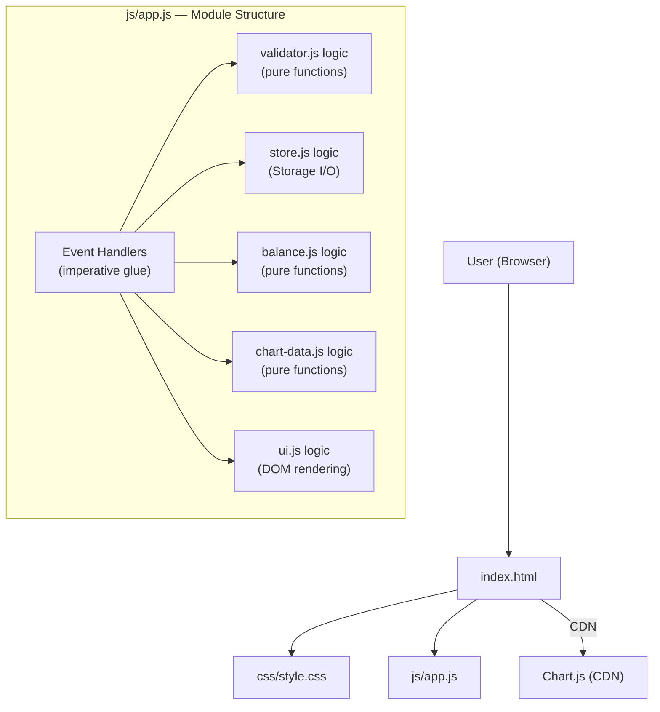
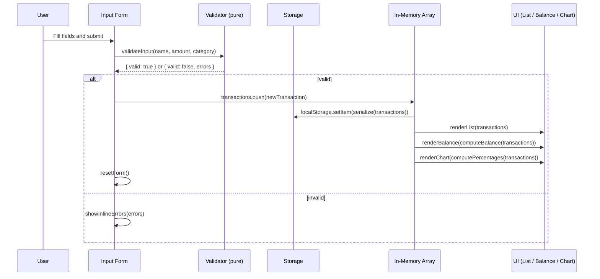

# Design Document: Expense & Budget Visualizer

## Overview

The Expense & Budget Visualizer is a fully client-side single-page web application built with plain HTML, CSS, and Vanilla JavaScript. It enables users to record personal expenses, view a running total balance, and visualize spending distribution across three fixed categories (Food, Transport, Fun) via a pie chart powered by Chart.js loaded from a CDN.

All data is persisted in the browser's Local Storage — no server, no build step, no package manager. The app is structured around four logical UI sections that share a single source of truth: an in-memory `transactions` array that is synchronized to Local Storage on every mutation.

**Key design principles:**

- **Single source of truth**: the in-memory `transactions` array is the canonical state. All UI sections (list, balance, chart) derive their display from this array.
- **Pure logic, impure shell**: validation, balance calculation, and chart percentage computation are implemented as pure functions. DOM manipulation and Storage I/O are isolated in a thin imperative shell.
- **No framework, no build**: plain ES6 modules (or IIFE if module support is a concern), loaded directly in the browser.

---

## Architecture



Since the requirement is a single JS file (`js/app.js`), the logical modules above are implemented as separate namespaced functions or clearly delineated sections within that single file rather than separate ES module files. This keeps the structure maintainable while satisfying Requirement 7.

**Data flow on user action (add transaction):**



---

## Components and Interfaces

### 1. Validator

Responsible for validating raw form input before a Transaction is created.

```js
/**
 * @typedef {Object} ValidationResult
 * @property {boolean} valid
 * @property {{ name?: string, amount?: string, category?: string }} errors
 */

/**
 * Validates raw form input.
 * Pure function — no side effects.
 *
 * @param {string} name     - Raw item name input
 * @param {string} amount   - Raw amount input (string from <input>)
 * @param {string} category - Selected category value
 * @returns {ValidationResult}
 */
function validateInput(name, amount, category) { ... }
```

Validation rules:
- `name`: must be non-empty after trimming whitespace; max 100 characters
- `amount`: must parse to a finite number in the range [0.01, 999999999.99]
- `category`: must be exactly one of `"Food"`, `"Transport"`, `"Fun"`

---

### 2. Transaction Factory

Creates a normalized Transaction object from validated inputs.

```js
/**
 * @typedef {Object} Transaction
 * @property {string} id        - UUID or timestamp-based unique ID
 * @property {string} name      - Trimmed item name
 * @property {number} amount    - Parsed float, rounded to 2dp
 * @property {string} category  - "Food" | "Transport" | "Fun"
 * @property {number} createdAt - Unix timestamp (Date.now())
 */

/**
 * @param {string} name
 * @param {string} amount  - raw string input
 * @param {string} category
 * @returns {Transaction}
 */
function createTransaction(name, amount, category) { ... }
```

---

### 3. Store (Storage I/O)

Handles reading and writing the transactions array to Local Storage.

```js
const STORAGE_KEY = 'expense_visualizer_transactions';

/** @returns {Transaction[]} */
function loadTransactions() { ... }  // reads + JSON.parse; returns [] on failure

/** @param {Transaction[]} transactions */
function saveTransactions(transactions) { ... }  // JSON.stringify + setItem
```

Error handling: `loadTransactions` wraps `JSON.parse` in try/catch and returns `[]` on failure, setting a flag for the UI to display the storage-unavailable warning.

---

### 4. Balance Calculator

Pure function computing the total balance.

```js
/**
 * @param {Transaction[]} transactions
 * @returns {string}  e.g. "1234.56"
 */
function computeBalance(transactions) {
    const total = transactions.reduce((sum, t) => sum + t.amount, 0);
    return total.toFixed(2);
}
```

---

### 5. Chart Data Calculator

Pure function computing per-category percentages for the pie chart.

```js
/**
 * @typedef {Object} CategoryData
 * @property {string} label       - Category name
 * @property {number} percentage  - 0–100, rounded to 2dp
 * @property {number} total       - Raw sum for the category
 */

/**
 * Returns only categories with total > 0.
 * Percentages are relative to the grand total.
 *
 * @param {Transaction[]} transactions
 * @returns {CategoryData[]}
 */
function computeCategoryData(transactions) { ... }
```

---

### 6. UI Renderer

Imperative functions that update the DOM. These are not pure — they read/write DOM state.

```js
function renderTransactionList(transactions) { ... }  // rebuilds list HTML
function renderBalance(balanceStr) { ... }             // updates balance text
function renderChart(categoryData) { ... }             // updates/creates Chart.js instance
function showFormErrors(errors) { ... }                // displays inline error messages
function clearFormErrors() { ... }                     // clears all inline errors
function resetForm() { ... }                           // clears form fields
function showStorageWarning() { ... }                  // shows dismissible banner
function showChartFallback() { ... }                   // shown if Chart.js CDN fails
```

---

### 7. Event Handlers (Glue)

The imperative shell that wires user actions to pure logic and UI updates.

```js
// Form submit
formEl.addEventListener('submit', (e) => {
    e.preventDefault();
    const result = validateInput(nameEl.value, amountEl.value, categoryEl.value);
    if (!result.valid) { showFormErrors(result.errors); return; }
    clearFormErrors();
    const tx = createTransaction(nameEl.value, amountEl.value, categoryEl.value);
    transactions.push(tx);
    saveTransactions(transactions);
    renderTransactionList(transactions);
    renderBalance(computeBalance(transactions));
    renderChart(computeCategoryData(transactions));
    resetForm();
});

// Delete (event delegation on list container)
listEl.addEventListener('click', (e) => {
    if (!e.target.matches('[data-delete-id]')) return;
    const id = e.target.dataset.deleteId;
    transactions = transactions.filter(t => t.id !== id);
    saveTransactions(transactions);
    renderTransactionList(transactions);
    renderBalance(computeBalance(transactions));
    renderChart(computeCategoryData(transactions));
});
```

---

## Data Models

### Transaction

```js
/**
 * @typedef {Object} Transaction
 * @property {string} id        - Unique identifier (crypto.randomUUID() or Date.now().toString(36) + Math.random())
 * @property {string} name      - Item name, trimmed, max 100 chars
 * @property {number} amount    - Positive float, stored with full precision, displayed to 2dp
 * @property {"Food"|"Transport"|"Fun"} category
 * @property {number} createdAt - Unix timestamp in milliseconds
 */
```

### Storage Schema

Transactions are stored as a JSON-serialized array under the key `"expense_visualizer_transactions"`:

```json
[
  {
    "id": "lxk9f2a",
    "name": "Lunch",
    "amount": 12.50,
    "category": "Food",
    "createdAt": 1727001600000
  }
]
```

### Chart.js Dataset Shape

```js
{
    labels: ["Food", "Fun"],          // only categories with total > 0
    datasets: [{
        data: [62.50, 37.50],         // percentage values
        backgroundColor: ["#4CAF50", "#FF5722"]  // unique per category
    }]
}
```

Category color mapping (fixed, ensures Requirement 4.5):

| Category  | Color   | Hex       |
|-----------|---------|-----------|
| Food      | Green   | `#4CAF50` |
| Transport | Blue    | `#2196F3` |
| Fun       | Orange  | `#FF5722` |

---

## Correctness Properties

*A property is a characteristic or behavior that should hold true across all valid executions of a system — essentially, a formal statement about what the system should do. Properties serve as the bridge between human-readable specifications and machine-verifiable correctness guarantees.*

### Property 1: Validator correctness

*For any* triple of (name, amount, category) inputs, `validateInput` SHALL return `valid: true` if and only if: the trimmed name is non-empty and at most 100 characters, the amount parses to a finite number in [0.01, 999999999.99], and the category is one of `"Food"`, `"Transport"`, or `"Fun"`. For all other inputs, it SHALL return `valid: false` with errors identifying each offending field.

**Validates: Requirements 1.2, 1.3, 1.6**

---

### Property 2: Balance calculation accuracy

*For any* list of transactions (including the empty list), `computeBalance(transactions)` SHALL equal `transactions.reduce((s, t) => s + t.amount, 0).toFixed(2)`, and the result for an empty list SHALL be `"0.00"`.

**Validates: Requirements 3.1, 3.4**

---

### Property 3: Category percentage integrity

*For any* non-empty list of transactions, `computeCategoryData(transactions)` SHALL return only categories with a total amount greater than zero, and the sum of all returned percentage values SHALL equal 100 (within floating-point rounding tolerance of ±0.01). Each category's percentage SHALL equal `(categoryTotal / grandTotal) * 100`.

**Validates: Requirements 4.1, 4.7**

---

### Property 4: Transaction list ordering and formatting

*For any* list of transactions rendered by `renderTransactionList`, each entry's displayed amount SHALL be formatted to exactly 2 decimal places, and entries SHALL appear in the same order as their position in the source transactions array (insertion order preserved).

**Validates: Requirements 2.1**

---

### Property 5: Delete removes the correct transaction

*For any* list of transactions and any valid transaction id in that list, after filtering out that id (`transactions.filter(t => t.id !== id)`), the resulting list SHALL NOT contain any transaction with that id, SHALL contain all other transactions unchanged, and SHALL have length exactly one less than the original list.

**Validates: Requirements 2.3**

---

### Property 6: Transaction serialization round-trip

*For any* list of valid Transaction objects, serializing to JSON and parsing back (`JSON.parse(JSON.stringify(transactions))`) SHALL produce a list of objects with equivalent `id`, `name`, `amount`, `category`, and `createdAt` values for each transaction.

**Validates: Requirements 5.3**

---

## Error Handling

### Validation Errors (Requirement 1.3, 1.4, 1.6)

- Errors are displayed inline, adjacent to the offending field, using a `<span class="field-error">` element inserted after each input.
- All existing error messages are cleared on every new submit attempt before re-validation.
- Transaction creation is blocked; no Storage write or UI update occurs.

### Storage Unavailable (Requirement 5.4)

- `loadTransactions()` wraps all Storage access in try/catch.
- On failure (SecurityError, JSON parse error, quota exceeded): returns `[]` and sets `storageAvailable = false`.
- The app continues to function in-memory for the session. A dismissible warning banner is displayed at the top of the page.
- `saveTransactions()` silently fails (logs to console) when `storageAvailable = false` to avoid breaking the interaction loop.

### Delete Failure (Requirement 2.5)

- `saveTransactions()` wraps `localStorage.setItem` in try/catch.
- On failure: the in-memory array is not mutated (rollback), the list/balance/chart are re-rendered from the unchanged array, and an error toast/message is shown to the user.

### Chart.js CDN Failure (Requirement 7.5)

- A fallback `<div id="chart-fallback">` is placed inside the chart container and hidden by default.
- The Chart.js `<script>` tag is given an `onerror` handler: `onerror="document.getElementById('chart-fallback').style.display='block'"`.
- All non-chart functionality (form, list, balance) continues to work normally.

---

## Testing Strategy

### Dual Testing Approach

Unit tests cover specific examples and edge cases. Property-based tests verify universal correctness guarantees. Both are necessary and complementary.

### Property-Based Testing Library

Use **[fast-check](https://github.com/dubzzz/fast-check)** for JavaScript property-based testing. Load via CDN in the test HTML, or use via Node.js with a test runner (Jest or Vitest) if a test environment is set up.

Each property test runs a minimum of **100 iterations** per property.

### Property Tests

Each property test references its design property via a comment tag:
`// Feature: expense-budget-visualizer, Property {N}: {property_text}`

| Property | Test Description | Generator Inputs |
|---|---|---|
| P1: Validator correctness | For random (name, amount, category) tuples, validator output matches expected valid/invalid decision | `fc.string()`, `fc.float()`, `fc.string()` — include whitespace-only names, out-of-range amounts, invalid categories |
| P2: Balance calculation | For random transaction lists, computeBalance equals reduce+toFixed(2) | `fc.array(fc.record({ amount: fc.float({ min: 0.01, max: 999999999.99 }) }))`, include empty array |
| P3: Category percentages | For random transaction lists, percentages sum to 100 and zero-total categories are excluded | `fc.array(fc.record({ category: fc.constantFrom('Food','Transport','Fun'), amount: fc.float({min:0.01}) }))` — include cases where one/two categories have no transactions |
| P4: List ordering and formatting | For random transaction lists, rendered HTML preserves insertion order and formats amounts to 2dp | `fc.array(transactionArbitrary)` |
| P5: Delete correctness | For random list and random valid index, filter by id produces correct result | `fc.array(transactionArbitrary, {minLength:1})` + `fc.integer` for index |
| P6: Serialization round-trip | For random transaction lists, JSON round-trip preserves all fields | `fc.array(transactionArbitrary)` |

### Unit Tests

Focus on specific examples, integration points, and error conditions:

- **Form submission — valid input**: Submit a fully filled form, verify transaction appears in list, balance updates, chart updates, form resets within 500ms.
- **Form submission — each invalid case**: Empty name, whitespace-only name, amount = 0, amount = negative, amount > max, no category selected — verify correct error message shown, transaction count unchanged.
- **Delete**: Click delete on a specific transaction, verify it disappears from list and balance updates.
- **Empty state**: Start with no transactions — verify empty-state message in list, "0.00" balance, no-data message in chart area.
- **Storage load on init**: Pre-populate localStorage with valid JSON, reload app, verify all transactions render correctly.
- **Storage unavailable**: Mock `localStorage.setItem` to throw, verify warning banner appears and in-memory state is retained.
- **Chart.js CDN failure**: Mock `window.Chart` as undefined, verify fallback message displays.
- **Category colors**: Verify Food, Transport, and Fun are assigned distinct hex colors.
- **Responsive layout**: At 767px viewport, verify single-column stacking (CSS media query smoke test).

### Integration Tests

- **Full add-delete cycle**: Add 3 transactions across all categories, verify balance and chart percentages, delete one, verify all three UI sections update correctly.
- **Page reload persistence**: Add transactions, reload the page, verify all transactions are restored from localStorage.
- **Storage parse error recovery**: Set `localStorage['expense_visualizer_transactions']` to invalid JSON, reload, verify app starts empty with warning.
